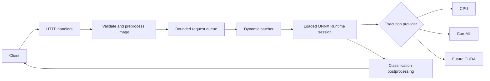

# inference-server

A C++20 learning project for image-classification inference serving with ONNX Runtime. The goal is to make model lifetime, bounded work queues, dynamic batching, execution providers, and latency/throughput trade-offs visible in a small codebase.

The project is implemented in small milestones. It currently includes the generic ONNX runner, ImageNet image preprocessing, bounded queue, single-worker dynamic batcher, aggregate metrics, and a small HTTP API. Benchmarking and the final learning notes are being added next.

## Planned request flow



The intended server keeps one model session loaded for its lifetime. A classification adapter will handle image-specific preprocessing and labels; the model runner will remain generic over ONNX tensor inputs and outputs.

## Current milestone

The repository contains a bounded queue, a generic ONNX Runtime C++ runner, a model-specific ImageNet classification pipeline, a single-worker dynamic batcher, and thread-safe aggregate metrics. The runner reads tensor names, shapes, and element types from the ONNX model once at startup, then keeps the session alive for subsequent inference calls. The pipeline decodes JPEG/PNG, resizes and normalizes images into NCHW tensors, then maps logits to ImageNet labels. The queue is provider-independent; producers use non-blocking submission, and closing it wakes consumers and drains accepted work. The batcher collects requests until its size limit or first-request deadline, combines tensors along dimension zero, and splits outputs back in request order. Metrics track request outcomes, queue depth, batch sizes, and mean queue, inference, and end-to-end latency.

```sh
./scripts/setup_onnxruntime.sh
cmake -S . -B build
cmake --build build --parallel 2
ctest --test-dir build --output-on-failure
```

The setup script installs the pinned ONNX Runtime 1.30.0 C/C++ package under `.deps/onnxruntime`. The macOS arm64 package includes the CoreML Execution Provider; the Linux packages use CPU execution. Set `ONNXRUNTIME_ROOT` if the runtime is installed elsewhere. FetchContent pins nlohmann/json 3.12.0 and stb_image to a commit; GoogleTest is found locally or fetched at 1.17.0.

Download model files and ImageNet labels with:

```sh
./scripts/download_models.sh
```

The model files are kept out of git and verified against SHA-256 before use. Each model's configuration lives in `config/`; preprocessing options are deliberately kept out of the generic `ModelRunner`.

Run the ResNet-18 server from the repository root:

```sh
./build/inference-server \
  --model models/resnet18.onnx \
  --config config/resnet18.json \
  --provider cpu
```

Use `--config config/mobilenet.json` with `models/mobilenet.onnx` for MobileNet. The server binds to `127.0.0.1:8080` by default; use `--help` to see the thread, batching, queue, bind, and port options.

## HTTP API

- `GET /health` reports server status and queue depth.
- `GET /model` returns the loaded model's provider and ONNX tensor metadata.
- `GET /metrics` returns request counts, batch size, queue depth, and mean latency measurements.
- `POST /predict` accepts a raw JPEG or PNG body and returns the top five ImageNet labels. If the inference queue is full, it returns HTTP 503.

The HTTP layer uses four handler threads by default and a bounded pending-request queue. The inference queue remains a separate bounded queue so its overload behavior is visible.

## Planned dependencies

- ONNX Runtime C++ API for model loading and inference.
- `cpp-httplib` for the small HTTP server and benchmark client.
- `nlohmann/json` for model configuration and JSON responses.
- CLI11 for command-line options.
- GoogleTest for unit tests.
- `stb_image` for JPEG/PNG decoding and model-specific resizing/normalization.
- CMake and the C++ standard library for the build and concurrency primitives.

Model sources, licenses, input sizes, normalization, and checksums are documented in `models/README.md` and `scripts/download_models.sh`.
