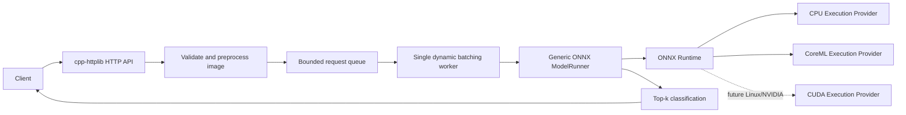

# inference-server

A compact C++20 image-classification server built to explore practical ML inference infrastructure: ONNX Runtime, bounded queues, dynamic batching, backpressure, execution providers, and latency measurement.

## What it does

The server loads one pretrained ONNX model at startup and serves JPEG or PNG classification requests over HTTP. It supports ResNet-18 and MobileNet, with CPU execution and CoreML on Apple platforms. It is a learning and portfolio project, not a production serving platform.

## Architecture



## Features

- Generic ONNX model loading with runtime tensor names, shapes, and element types.
- ImageNet JPEG/PNG preprocessing and top-k postprocessing, kept separate from model execution.
- A bounded queue with explicit HTTP 503 overload behavior.
- One inference worker that collects compatible requests by batch size or deadline and maps outputs back in order.
- CPU and CoreML provider selection, a small JSON HTTP API, aggregate metrics, and a modest load-test client.
- GoogleTest coverage for queueing, batching, model metadata, preprocessing, metrics, and HTTP behavior.

## Batching and backpressure

The batcher takes the first queued request, then waits up to `--max-batch-delay-ms` for more requests or until `--max-batch-size` is reached. A larger batch can improve throughput while adding queueing delay; a smaller batch usually favors latency. It combines input tensors along dimension zero and splits the model output in the same order, so each waiting HTTP request receives its own result.

The request queue has a fixed capacity (`--queue-capacity`, default 64). Producers do not wait indefinitely when it is full: the API returns 503 with `Retry-After`. This bounds queued memory and makes overload visible. Shutdown closes the queue, wakes its consumer, drains accepted requests, and joins the inference worker.

## Model execution and preprocessing

`ModelRunner` owns one ONNX Runtime session for the server lifetime and is generic over tensor inputs and outputs. It reads model metadata from ONNX Runtime rather than assuming tensor names or output shapes. `ImageClassificationPipeline` handles the model-specific parts: decoding, resizing, RGB normalization, NCHW layout, labels, softmax, and top-k results.

Dynamic batching is enabled only when the model metadata has a dynamic leading dimension for both input and output. The bundled MobileNet export has a fixed batch dimension of 1, so run it with `--max-batch-size 1`; the server rejects a larger batch setting rather than reshaping it silently.

## Execution providers

- `cpu` is the conservative default, with two ONNX Runtime intra-op threads.
- `coreml` selects Apple's CoreML Execution Provider when the installed ONNX Runtime package includes it. CoreML is Apple's ML execution framework; selecting it does not establish whether an operation ran on CPU, GPU, or Neural Engine.
- `cuda` is future work for Linux/NVIDIA. It is deliberately not implemented for this Apple Silicon project.

The project uses ONNX Runtime, cpp-httplib, nlohmann/json, CLI11, GoogleTest, and stb_image. Standard C++ synchronization primitives implement the educational bounded queue and single-worker batcher; generic HTTP, JSON, CLI, and testing infrastructure comes from established libraries.

## Models

The download script fetches pinned ONNX Model Zoo exports and verifies each model's SHA-256. Model files and labels are ignored by git. Sources, license, input size, normalization, URLs, and checksums are listed in [models/README.md](models/README.md).

```sh
./scripts/setup_onnxruntime.sh
./scripts/download_models.sh
cmake -S . -B build
cmake --build build --parallel 2
ctest --test-dir build --output-on-failure
```

The setup script installs the pinned ONNX Runtime C/C++ package under `.deps/onnxruntime`. Set `ONNXRUNTIME_ROOT` to use another installation. CMake fetches pinned versions of the remaining dependencies when they are not already installed.

## Run

From the repository root:

```sh
./build/inference-server \
  --model models/resnet18.onnx \
  --config config/resnet18.json \
  --provider cpu \
  --threads 2 \
  --max-batch-size 8 \
  --max-batch-delay-ms 2 \
  --queue-capacity 64 \
  --port 8080
```

For MobileNet, use `models/mobilenet.onnx` and `config/mobilenet.json`, with `--max-batch-size 1`. On a Mac with CoreML available, set `--provider coreml`. Run `./build/inference-server --help` for all options.

## HTTP API

- `GET /health` reports status and queue depth/capacity.
- `GET /model` reports the selected provider and ONNX tensor metadata.
- `GET /metrics` reports request counts, queue depth, batch size, and mean timing values.
- `POST /predict` accepts a raw `image/jpeg` or `image/png` body and returns five ImageNet predictions. Invalid images return 400, unsupported media types return 415, and a full inference queue returns 503.

## Benchmark

Start the server, then explicitly run a short load test with a local JPEG or PNG:

```sh
./build/benchmark \
  --url http://127.0.0.1:8080 \
  --image path/to/image.jpg \
  --concurrency 4 \
  --duration 10
```

The client reports requests per second and end-to-end mean/p50/p95/p99 latency. It also reads server metrics before and after the run to report average batch size, queue waiting time, and model execution time. End-to-end latency includes HTTP handling and preprocessing; model execution time is measured around the ONNX call.

### Measured smoke runs

These short local runs were measured on a MacBook Pro M3 Pro using the same generated 224×224 PNG. They verify actual CPU/CoreML inference and the load-test path; the synthetic image and two-second duration make them smoke measurements, not an accuracy result or a performance guarantee.

| Model / provider | Clients | Max batch | Requests/s | E2E mean / p50 / p95 / p99 (ms) | Avg batch | Queue wait / inference (ms) |
|---|---:|---:|---:|---:|---:|---:|
| ResNet-18 / CPU | 1 | 1 | 28.0 | 36.16 / 35.36 / 40.42 / 51.49 | 1.00 | 1.93 / 21.64 |
| MobileNet / CPU | 1 | 1 | 48.0 | 21.00 / 20.69 / 22.25 / 32.58 | 1.00 | 1.91 / 6.73 |
| ResNet-18 / CoreML | 1 | 1 | 66.5 | 15.06 / 14.93 / 15.72 / 16.87 | 1.00 | 1.91 / 1.09 |

Each run used two seconds, one client, batch size one, two ONNX Runtime intra-op threads, and no batch delay. CoreML provider execution succeeded, but these measurements do not show which Apple hardware unit executed the graph. Performance depends on model, image, provider, and batching settings; repeat controlled runs before drawing broader conclusions.

A `ps` sample during each benchmark reported process RSS of 169,472 KB for ResNet CPU, 85,088 KB for MobileNet CPU, and 335,136 KB for ResNet CoreML. The same samples reported 151.2%, 150.4%, and 87.4% CPU, respectively; macOS can report more than 100% when a process uses multiple cores. These are single process snapshots, not peak or sustained resource measurements.

## Queue and concurrency model

HTTP handler threads validate and preprocess an image, then submit a value-owned request to the bounded queue. Each request carries a `std::promise`; its HTTP handler waits on the corresponding future. A single `std::jthread` owns batch collection and calls the model runner. It completes each promise with the matching output or the inference exception. The queue's mutex protects its deque and closed state; its condition variable lets the worker sleep until work or shutdown arrives.

The queue is intentionally implemented here because it is a small, useful concurrency exercise. A production service might use a mature concurrent queue or an inference server such as NVIDIA Triton after measuring the need.

## Limitations and next steps

- One model and one inference worker per server process; no hot reload, auth, persistence, or multi-model routing.
- Metrics are process-local aggregate means, not histograms or a monitoring backend.
- CoreML device placement is not inspected, and CUDA is not implemented.
- MobileNet's bundled ONNX export has fixed batch size 1.
- The HTTP API is intentionally small and uses a single image per request.

Realistic next steps are a Linux/NVIDIA CUDA provider, controlled CPU/CoreML/CUDA benchmark runs on suitable hardware, and a comparison with NVIDIA Triton. See [docs/INTERVIEW_NOTES.md](docs/INTERVIEW_NOTES.md) for learning notes and interview practice.
