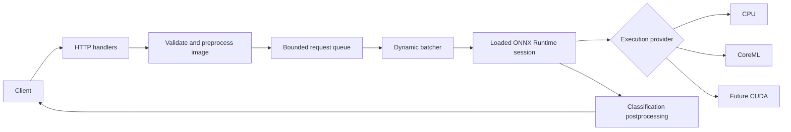

# inference-server

A C++20 learning project for image-classification inference serving with ONNX Runtime. The goal is to make model lifetime, bounded work queues, dynamic batching, execution providers, and latency/throughput trade-offs visible in a small codebase.

> The project is being built in milestones. The first milestone currently contains the CMake foundation and bounded queue; the ONNX runner and HTTP API are not implemented yet.

## Planned request flow



The intended server keeps one model session loaded for its lifetime. A classification adapter will handle image-specific preprocessing and labels; the model runner will remain generic over ONNX tensor inputs and outputs.

## Current milestone

The bounded queue is a small, provider-independent foundation. Producers use `try_push`, so the HTTP layer can reject work when the queue is full instead of accumulating unbounded memory. Closing the queue wakes the consumer and lets it drain accepted work before it exits.

```sh
cmake -S . -B build
cmake --build build --parallel 2
ctest --test-dir build --output-on-failure
```

## Planned dependencies

- ONNX Runtime C++ API for model loading and inference.
- `cpp-httplib` for the small HTTP server and benchmark client.
- `nlohmann/json` for model configuration and JSON responses.
- CLI11 for command-line options.
- GoogleTest for unit tests.
- `stb_image` for JPEG/PNG decoding; the classification adapter will own resizing and normalization.
- CMake and the C++ standard library for the build and concurrency primitives.

The dependency versions, ONNX Runtime installation path, model URLs, and checksums will be pinned and documented as their integration milestones are implemented.
